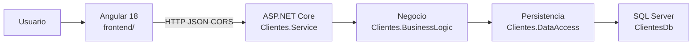

# Arquitectura

Sistema de Administración de Clientes: Angular 18 consume una API REST en .NET 8, que aplica reglas de negocio y persiste en SQL Server con Entity Framework Core.

## Vista de contexto



Flujo obligatorio de extremo a extremo:

`Angular 18 → API REST → lógica de negocio → EF Core → SQL Server`

## Solución

La separación de capas es por **proyectos**, no por carpetas dentro de un solo ensamblado.

```
Clientes.sln
├── Clientes.DataAccess              DbContext, entidad, repositorio, migraciones
├── Clientes.BusinessLogic           DTOs, validaciones, servicio de negocio
├── Clientes.Service                 Host HTTP: controladores, DI, CORS, Swagger
├── Clientes.BusinessLogic.Tests     Pruebas unitarias de reglas críticas
frontend/                            SPA Angular 18
database/                            Script SQL y seed
docs/                                Documentación técnica y de diseño
postman/                             Colección de la API
```

### Dependencias

```
Clientes.Service ──► Clientes.BusinessLogic ──► Clientes.DataAccess
       │                                              ▲
       └──────────────────────────────────────────────┘
```

`Clientes.Service` referencia también `DataAccess` **solo** para registrar `DbContext` y el repositorio en el contenedor de DI. Los controladores no usan EF ni entidades.

`DataAccess` no referencia a nadie del dominio de aplicación. No hay reglas de negocio ahí.

---

## Backend

### Clientes.DataAccess

Responsabilidad: persistencia asíncrona.

| Pieza | Rol |
| --- | --- |
| `Entities/Cliente` | Modelo de tabla `dbo.Clientes` |
| `Configurations/ClienteConfiguration` | Fluent API: longitudes, índices, unique de correo |
| `ClientesDbContext` | EF Core |
| `IClienteRepository` / `ClienteRepository` | Acceso a datos |
| `Migrations/` | Esquema versionado |

El repositorio:

- Lecturas con `AsNoTracking` cuando no hay seguimiento.
- Búsqueda, filtro `Activo`, paginación y orden **en SQL**.
- No valida correos ni fechas; eso es de negocio.

### Clientes.BusinessLogic

Responsabilidad: casos de uso.

| Pieza | Rol |
| --- | --- |
| `IClienteService` / `ClienteService` | Alta, consulta, edición, baja lógica |
| `DTOs` | Contrato de la API; las entidades no salen |
| `ClienteValidador` | Obligatorio, longitudes, correo, fecha no futura, paginación |
| `ClienteMapper` | DTO ↔ entidad; normaliza correo a minúsculas |
| Excepciones | `ValidacionNegocioException`, `RecursoNoEncontradoException`, `ConflictoNegocioException` |

Reglas clave:

- Correo único (consulta + índice único).
- Baja lógica: `Activo = false`; no se borra la fila.
- `FechaRegistro` / `FechaModificacion` las asigna el backend en UTC.
- `CancellationToken` en toda la cadena async.

### Clientes.Service

Responsabilidad: transporte HTTP.

| Pieza | Rol |
| --- | --- |
| `Controllers/ClientesController` | Delgada: traduce HTTP ↔ servicio |
| `ManejadorExcepcionesGlobal` | `IExceptionHandler` → `ProblemDetails` |
| `Program.cs` | DI, CORS, Swagger, cadena de conexión |

Códigos:

| HTTP | Caso |
| --- | --- |
| 200 | Consulta / modificación |
| 201 | Alta (`Location` del recurso) |
| 204 | Baja lógica |
| 400 | Validación |
| 404 | Cliente inexistente |
| 409 | Correo duplicado o ya inactivo |
| 500 | Error no controlado (sin stack trace ni SQL) |

---

## Frontend

Angular 18 standalone. El UI **solo** habla con `/api/clientes`.

```
frontend/src/app/
├── app.config.ts              Router, HttpClient, interceptores
├── app.routes.ts
├── core/
│   ├── interceptors/          carga + errores HTTP
│   └── services/carga.service.ts
├── clientes/
│   ├── components/            lista y formulario
│   ├── models/                tipos alineados al JSON camelCase
│   └── services/cliente.service.ts
├── shared/                    diálogo de confirmación, paginador ES
└── environments/              URL de la API por ambiente
```

Rutas:

| Ruta | Pantalla |
| --- | --- |
| `/clientes` | Listado paginado |
| `/clientes/nuevo` | Alta |
| `/clientes/:id/editar` | Edición |

Transversal:

- `cargaInterceptor` mueve el indicador global.
- `errorInterceptor` muestra `ProblemDetails.detail` (o el primer error de validación).
- Confirmación obligatoria antes de la baja.

---

## Recorrido de una petición

Ejemplo: `POST /api/clientes`

1. Angular (`ClienteService`) envía `ClienteEscritura`.
2. `ClientesController.Crear` delega en `IClienteService`.
3. `ClienteValidador` lanza 400 si los datos no cumplen.
4. El servicio pregunta `ExisteCorreoAsync`; si existe, 409.
5. Mapper crea la entidad, pone `Activo = true` y `FechaRegistro`.
6. Repositorio `Add` + `SaveChanges`.
7. Respuesta 201 con `ClienteDto`.

La consulta `GET /api/clientes?pagina=1&tamanioPagina=10&buscar=...&activo=true` pagina en servidor; Angular no trae la tabla completa.

---

## Datos

Tabla `dbo.Clientes`:

- PK `ClienteId` identity
- Correo único (`UQ_Clientes_Correo`)
- Índice de listado `IX_Clientes_Nombre` (ApellidoPaterno, Nombre)
- `Activo` para baja lógica

Dos formas de crear el esquema (excluyentes): script `database/ClientesDb.sql` o migraciones EF.

---

## Inyección de dependencias

En `Program.cs`, ciclo de vida `Scoped` (un alcance por request HTTP):

- `ClientesDbContext`
- `IClienteRepository` → `ClienteRepository`
- `IClienteService` → `ClienteService`

El controlador depende de la **interfaz** de negocio, no de la implementación ni del repositorio.

---

## Seguridad de configuración

- Cadena `ConnectionStrings:ClientesDb` en Development (Windows Auth, sin password en el repo).
- Producción: variable `ConnectionStrings__ClientesDb` o user secrets.
- CORS limitado a orígenes de `Cors:Origenes` (por defecto `http://localhost:4200`).
- La API no expone excepciones internas al cliente.

No hay autenticación: quedó fuera de alcance del ejercicio.

---

## Pruebas

`Clientes.BusinessLogic.Tests` (xUnit + Moq) cubre:

- Alta válida
- Correo duplicado
- Nombre vacío / fecha futura
- Modificación de inexistente
- Baja lógica

El frontend prueba `ClienteService` con `HttpClientTesting`.

---

## Decisiones

| Decisión | Motivo |
| --- | --- |
| Tres proyectos | Cumple el enunciado y evita mezclar EF en controladores |
| DTOs explícitos | No filtrar entidades de persistencia |
| Sin AutoMapper | Un solo agregado; el mapeo es claro |
| Baja vía DELETE HTTP | Contrato REST pedido; el efecto es lógico |
| Paginación en SQL | Listados grandes no viajan al cliente |
| Excepciones de negocio + handler | Un solo formato `ProblemDetails` |

---

## Fuera de alcance (producción)

Autenticación, autorización, auditoría de usuario, health checks, CI y reactivación de inactivos. Detalle visual: [README_DISENO.md](README_DISENO.md). Entrega funcional: [DOCUMENTO_TECNICO.md](DOCUMENTO_TECNICO.md).
